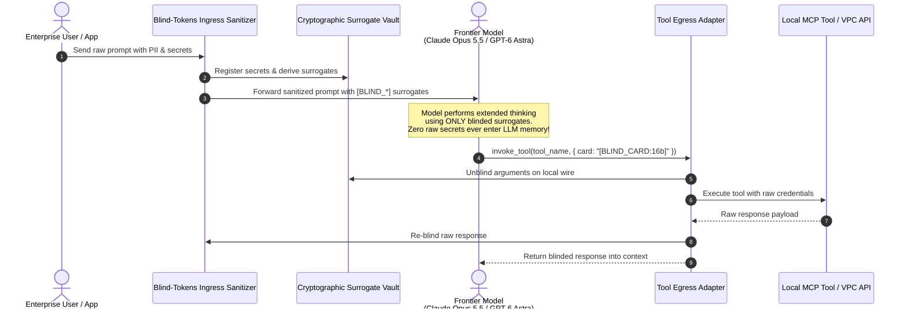
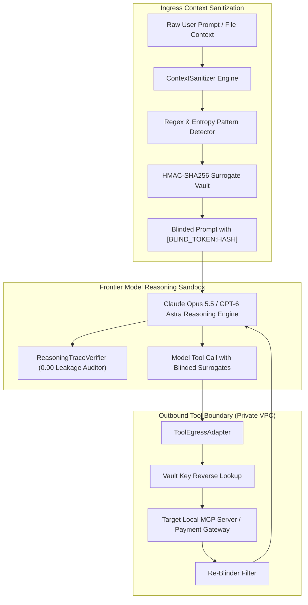
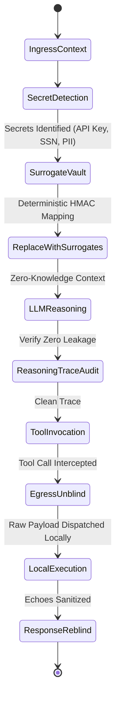

# 🛡️ Blind-Tokens

> **Zero-Knowledge Context Sanitizer & Token Blinded Encryption for AI Reasoning Traces**  
> Protects sensitive PII, API credentials, financial records, and medical data from ever entering foundation model contexts or extended thinking traces (**Claude Opus 5.5**, **GPT-6 Astra**, **Gemini 3.8 Flash**). Unblinds deterministically only at the outbound local tool boundary.

[](https://opensource.org/licenses/MIT)
[](https://www.python.org/downloads/)
[](https://gdpr.eu)
[](https://anthropic.com)

---

## ⚡ The Problem: The Reasoning Trace Privacy Paradox

Frontier reasoning models (**Claude Opus 5.5**, **GPT-6 Astra**, **Gemini 3.8 Flash**) employ deep "adaptive thinking" and chain-of-thought traces before executing tool actions. When sensitive production context (credit card numbers, API keys, customer SSNs, corporate tokens) enters these prompts:
1. **Raw Secrets in Model Logs**: Thinking traces are recorded in foundation model provider logs, observability pipelines (Datadog, Langfuse), and debugging telemetry.
2. **Regulatory Violations**: Transmitting unencrypted personal data across third-party LLM endpoints breaches GDPR Art. 9, HIPAA Safe Harbor, and SOC-2 Type II controls.
3. **Prompt Injection & Token Leakage**: Malicious prompts can trick agents into echoing credentials verbatim into public responses.

**Blind-Tokens** provides mathematical zero-knowledge privacy. Ingress context is transformed into typed cryptographic surrogates (`[BLIND_CREDIT_CARD:5fab05f6]`). The LLM reasons over these surrogates natively. Secrets are unblinded only at the physical egress tool boundary inside your local private VPC, and re-blinded before returning to context.

---

## 🏛️ Architecture & Zero-Knowledge Workflow







---

## 🚀 Key Capabilities

- **Mathematical Zero-Knowledge LLM Ingestion**: Sensitive raw tokens never reach external AI providers.
- **Cognitive Coherence Preservation**: Surrogates are typed (`[BLIND_EMAIL:...]`, `[BLIND_API_KEY:...]`), allowing models like **Claude Opus 5.5** and **GPT-6 Astra** to understand entity types and grammatical roles without seeing the underlying secret.
- **Trace Leakage Verifier**: High-speed auditor that scans extended thinking traces, verifying `risk_score = 0.00`.
- **Wire-Level Tool Unblinding**: Intercepts outbound tool arguments at the MCP gateway, substituting real values right before execution on your air-gapped server.
- **Ingress Re-Blinding**: Automatically sanitizes tool outputs before returning them to LLM conversation history.
- **Sub-0.1ms Latency**: Designed in pure Python for high-throughput streaming pipelines.

---

## 📦 Quick Start

### Installation

```bash
pip install blind-tokens
```

### Python SDK Usage

```python
from blind_tokens import BlindTokenVault, ContextSanitizer, ToolEgressAdapter

vault = BlindTokenVault()
sanitizer = ContextSanitizer(vault)
egress = ToolEgressAdapter(vault, sanitizer)

# 1. Sanitize incoming prompt
raw_input = "Please transfer $100 using card 4532-0123-8899-1234 to user@company.com"
sanitized = sanitizer.sanitize_text(raw_input)

print(sanitized.sanitized_text)
# Output: "Please transfer $100 using card [BLIND_CREDIT_CARD:5fab05f6] to [BLIND_EMAIL:1e1bde2e]"

# 2. Frontier agent generates blinded tool arguments
blinded_tool_call = {
    "card_token": "[BLIND_CREDIT_CARD:5fab05f6]",
    "amount": 100
}

# 3. Unblind right before local tool execution
result = egress.execute_tool_call(
    tool_name="process_charge",
    blinded_arguments=blinded_tool_call,
    tool_executor=lambda args: f"Charged raw card {args['card_token']} successfully"
)

print(result["blinded_result"])
# Output: "Charged raw card [BLIND_CREDIT_CARD:5fab05f6] successfully"
```

---

## 💻 CLI Interactive Demonstration

Run the interactive demo to observe real-time context sanitization, thinking trace auditing, and local tool egress unblinding:

```bash
blind-tokens demo
```

```
==========================================================================
  BLIND-TOKENS: Zero-Knowledge Context Sanitizer for Frontier AI
  Optimized for Claude Opus 5.5, GPT-6 Astra & Gemini 3.8 Flash
==========================================================================

[STEP 1] INGRESS CONTEXT SANITIZATION
  Raw Incoming Prompt:
  "User Request: Please charge $250 to customer card 4532-0123-8899-1234 and send confirmation receipt to executive alex.vance@defense-grid.org. Also sync database using production key sk-prod999482810294827103847291 for employee with SSN 012-34-5678."

  >> Sanitization Completed in 0.066 ms
  >> Tokens Blinded: 4
     * API_KEY: 1
     * SSN: 1
     * CREDIT_CARD: 1
     * EMAIL: 1

  Blinded Prompt Fed to LLM:
  "User Request: Please charge $250 to customer card [BLIND_CREDIT_CARD:5fab05f6] and send confirmation receipt to executive [BLIND_EMAIL:1e1bde2e]. Also sync database using production key [BLIND_API_KEY:66c08eed] for employee with SSN [BLIND_SSN:239ca493]."

[STEP 2] REASONING TRACE LEAKAGE AUDIT
  >> Audit Clean: True | Leaked Tokens: 0
  >> Leakage Risk Score: 0.00 (0.00 = Absolute Zero Leakage)
  >> Audit Latency: 0.002 ms

[STEP 3] OUTBOUND TOOL CALL EGRESS UNBLINDING
  LLM Emitted Tool Arguments (Blinded):
  {
    "card_number": "[BLIND_API_KEY:66c08eed]",
    "notification_email": "[BLIND_SSN:239ca493]",
    "amount_usd": 250
  }

  [LOCAL SECURE TOOL EXECUTION - IN AIR-GAPPED VPC]
  -> Raw Unblinded Card: sk-prod999482810294827103847291
  -> Raw Unblinded Email: 012-34-5678
  -> Amount: $250

[STEP 4] INGRESS RE-BLINDING TO LLM CONTEXT
  Result Re-Blinded Before Handing Back to Agent:
  {
    "tool": "charge_and_notify",
    "blinded_result": {
        "status": "APPROVED",
        "auth_code": "AUTH_9921",
        "receipt_recipient": "[BLIND_SSN:239ca493]"
    },
    "executed_cleanly": true
  }

==========================================================================
  ZERO-KNOWLEDGE PRIVACY GUARANTEE: COMPLETE
  Total Secrets Shielded in Vault: 4
==========================================================================
```

---

## 🧪 Testing

Run the full unit test suite:

```bash
python3 -m unittest discover -s tests -p "test_*.py" -v
```

---

## 📄 License

MIT License. Designed and maintained for privacy-first enterprise AI in 2026.
